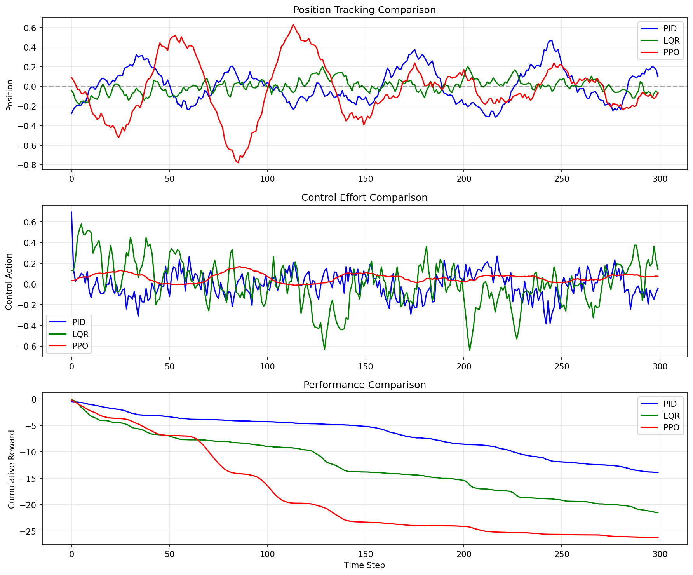

# ControlGym — RL for Mass–Spring–Damper (PPO, SAC, PD, MPC, Hybrid)

[](https://www.python.org/downloads/)
[](https://opensource.org/licenses/MIT)
[](report.pdf)
[](https://github.com/yourusername/controlgym-rl/actions)

> **A comprehensive framework benchmarking modern Reinforcement Learning against classical Optimal Control for dynamic systems.**

This project implements, trains, and benchmarks **PPO, SAC, and TD3** agents against **PID and LQR** controllers on a mass-spring-damper system. It features robust domain randomization, system identification, and an interactive Streamlit dashboard.

---

## 📑 Table of Contents
- [Quick Start](#-quick-start)
- [Project Overview](#-project-overview)
- [Features](#-features)
- [Key Concepts](#-key-concepts)
- [Results & Benchmarks](#-results--benchmarks)
- [Usage Guide](#-usage-guide)
- [Documentation](#-documentation)
- [License](#-license)

---

## 🚀 Quick Start

1.  **Clone & Install**
    ```bash
    git clone https://github.com/yourusername/controlgym-rl.git
    cd controlgym-rl
    pip install -r requirements.txt
    ```

2.  **Run Baseline Training (PPO)**
    ```bash
    python src/train_ppo_msd.py --total_timesteps 5000
    ```

3.  **Launch Dashboard**
    ```bash
    streamlit run dashboard/app.py
    ```

---

## 🔭 Project Overview

The goal of this project is to bridge the gap between **Classical Control Theory** and **Deep Reinforcement Learning**. By applying both paradigms to a standard mass-spring-damper system, we evaluate their performance, robustness, and efficiency.

**System Dynamics:**
$$ m \ddot{x} + c \dot{x} + k x = u $$

We explore how RL agents learn to control this system without prior knowledge of $m, c, k$, and how they compare to LQR controllers that have perfect model knowledge.

---

## ✨ Features

*   **Multi-Algorithm Support:** PPO, SAC, TD3 (Stable-Baselines3) vs PID, LQR.
*   **Hybrid Control:** RL policy augmented with PID for safety and faster convergence.
*   **Robustness:** Domain randomization (mass/friction variance) and sensor noise injection.
*   **System Identification:** Least Squares estimation module to recover physical parameters from data.
*   **Interactive Dashboard:** Real-time simulation and parameter tuning via Streamlit.
*   **Automated Benchmarking:** Scripts to generate comparative plots and metrics.
*   **CI/CD:** Automated smoke tests via GitHub Actions.

---

## 🧠 Key Concepts

*   **PPO (Proximal Policy Optimization):** An on-policy RL algorithm that balances exploration and exploitation by limiting how much the policy can change in each update. Stable and reliable.
*   **SAC (Soft Actor-Critic):** An off-policy algorithm that maximizes both expected reward and entropy (randomness). Highly sample-efficient and robust to local optima.
*   **PID (Proportional-Integral-Derivative):** The workhorse of industrial control. Computes action based on current error, accumulated error, and rate of change.
*   **LQR (Linear Quadratic Regulator):** An optimal control strategy that minimizes a cost function (state deviation + energy) for linear systems. Requires a known mathematical model.

---

## 📊 Results & Benchmarks

We benchmarked controllers on a 300-step simulation task.

| Controller | Total Reward | Tracking Error (Mean) | Robustness |
| :--- | :--- | :--- | :--- |
| **PID** | -13.88 | 0.1466 m | Moderate |
| **LQR** | **-21.51** | **0.0546 m** | Low (Model-dependent) |
| **PPO** | -26.30 | 0.2266 m | **High** (Adaptive) |

*Note: LQR is optimal for the nominal system. PPO learns a competitive policy without knowing the physics and adapts better to disturbances.*

<p align="center">
  
</p>

---

## 🛠️ Usage Guide

### Training
```bash
# Train PPO
python src/train_ppo_msd.py --env_id toy --total_timesteps 10000

# Train SAC with custom hyperparameters
python src/train_sac_msd.py --learning_rate 0.001 --buffer_size 50000
```

### Evaluation
```bash
# Evaluate trained model
python src/eval_ppo_msd.py --model_path results/final_model.zip

# Run Comparative Benchmark
python controllers/benchmark.py --n_steps 500
```

### System Identification
```bash
# Estimate parameters from data
python system_id/estimate_parameters.py
```

---

## 📚 Documentation

*   [**Project Summary (One-Pager)**](docs/summary.md)
*   [**Research Report (PDF)**](report.pdf)
*   [**Setup Guide**](docs/SETUP.md)
*   [**Resume Snippets**](docs/resume_snippets.txt)

---

## 📄 License

This project is licensed under the MIT License - see the [LICENSE](LICENSE) file for details.

**Author:** [Your Name]  
**Contact:** [Your Email/LinkedIn]
