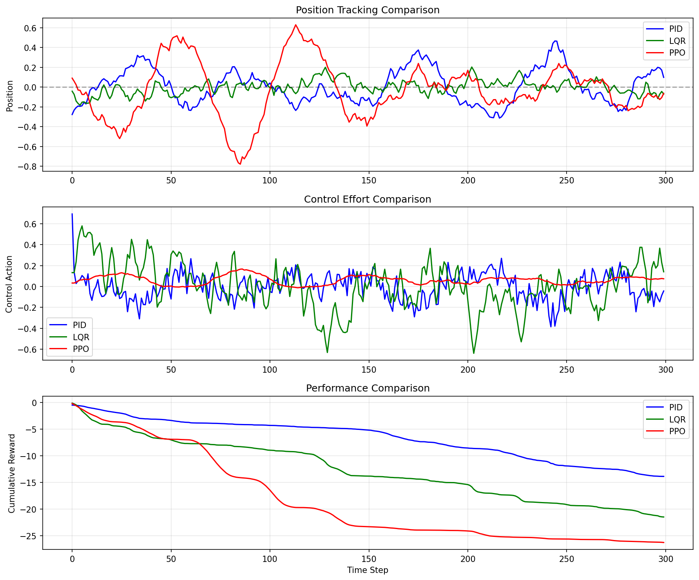
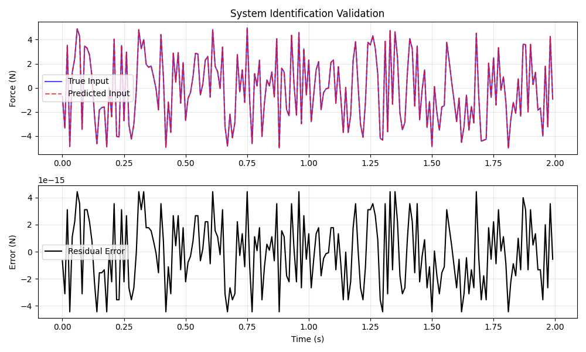
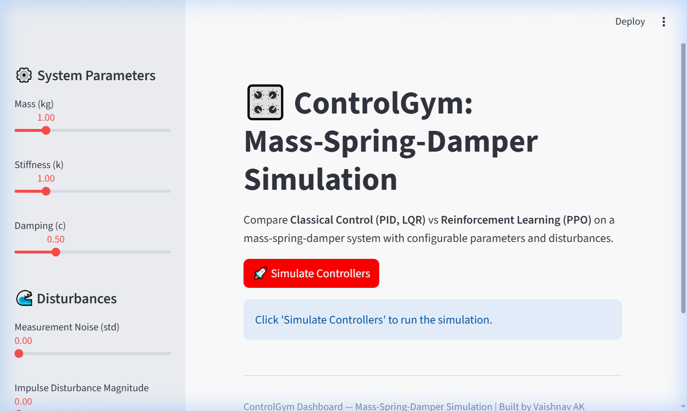
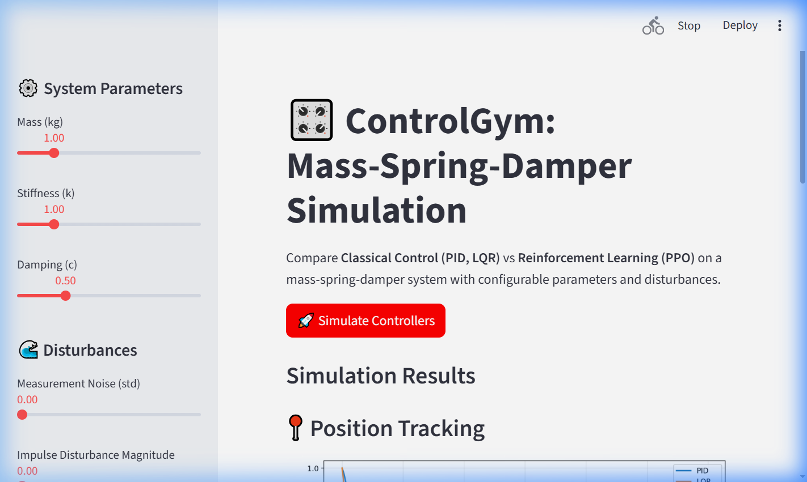
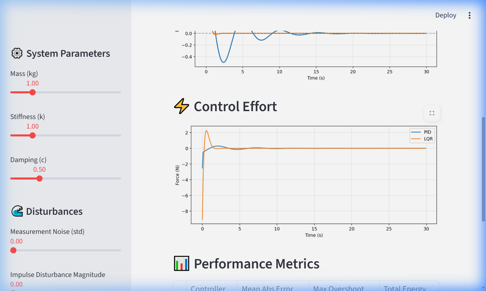

# 🎮 ControlGym — Reinforcement Learning vs Classical Control for Mass-Spring-Damper Systems

[](https://www.python.org/downloads/)
[](LICENSE)
[](https://github.com/vaishnavak2001/ControlGym-mass-spring-damper/actions)
[](report.pdf)

> **Can a neural network learn to control a physical system as well as a textbook controller?**
>
> This project answers that question by benchmarking deep RL agents (PPO, SAC, TD3) against classical optimal controllers (PID, LQR, MPC) on a mass-spring-damper system — one of the most fundamental problems in control engineering.

<p align="center">
  
</p>

---

## 📑 Table of Contents

- [Motivation](#-motivation)
- [Project Architecture](#-project-architecture)
- [Features](#-features)
- [Getting Started](#-getting-started)
- [Usage Guide](#-usage-guide)
- [Results & Analysis](#-results--analysis)
- [Interactive Dashboard](#-interactive-dashboard)
- [Project Structure](#-project-structure)
- [Key Concepts](#-key-concepts)
- [What I Learned](#-what-i-learned)
- [Completion Status](#-completion-status)
- [Future Work](#-future-work)
- [Documentation](#-documentation)
- [License & Contact](#-license--contact)

---

## 💡 Motivation

In robotics and industrial automation, control systems are the backbone of every moving part — from drone stabilization to robotic arms to vehicle suspension. Traditional controllers like PID and LQR are well-understood and mathematically elegant, but they rely on having an accurate model of the system. What happens when the model is wrong, or the environment changes?

**Reinforcement Learning** offers a compelling alternative: an agent that learns to control through trial and error, adapting to unknown dynamics. This project explores that frontier by implementing both paradigms on a standard benchmark system and comparing them head-to-head.

---

## 🏗️ Project Architecture

```
┌──────────────────────────────────────────────────────────┐
│                     ControlGym Framework                 │
│                                                          │
│  ┌─────────────┐    ┌──────────────┐    ┌─────────────┐  │
│  │  RL Agents  │    │  Classical   │    │   Hybrid    │  │
│  │  PPO / SAC  │    │  PID / LQR   │    │  RL + PD    │  │
│  │    / TD3    │    │    / MPC     │    │  Blending   │  │
│  └──────┬──────┘    └──────┬───────┘    └──────┬──────┘  │
│         │                  │                   │         │
│         └──────────────────┼───────────────────┘         │
│                            ▼                             │
│              ┌──────────────────────┐                    │
│              │   LinearControlEnv   │◄── ControlGym      │
│              │  (Mass-Spring-Damper) │                    │
│              └──────────┬───────────┘                    │
│                         │                                │
│         ┌───────────────┼───────────────┐                │
│         ▼               ▼               ▼                │
│  ┌─────────────┐ ┌─────────────┐ ┌──────────────┐       │
│  │ Benchmarks  │ │  Streamlit  │ │  System ID   │       │
│  │  & Plots    │ │  Dashboard  │ │  (Least Sq)  │       │
│  └─────────────┘ └─────────────┘ └──────────────┘       │
└──────────────────────────────────────────────────────────┘
```

### System Dynamics

The mass-spring-damper is governed by:

$$m \ddot{x} + c \dot{x} + k x = u$$

In state-space form ($\mathbf{x} = [x, \dot{x}]^T$):

$$\dot{\mathbf{x}} = \begin{bmatrix} 0 & 1 \\ -k/m & -c/m \end{bmatrix} \mathbf{x} + \begin{bmatrix} 0 \\ 1/m \end{bmatrix} u$$

---

## ✨ Features

| Category | Details |
|----------|---------|
| **RL Algorithms** | PPO, SAC, TD3 via Stable-Baselines3 with custom reward shaping |
| **Classical Control** | PID (tunable gains), LQR (Riccati solver), Sampling-based MPC |
| **Hybrid Control** | RL + PD blending with configurable λ weight |
| **Robustness** | Domain randomization, Gaussian sensor noise, impulse disturbances |
| **System ID** | Least Squares parameter estimation module |
| **Dashboard** | Interactive Streamlit app with real-time simulation |
| **Benchmarking** | Automated comparison scripts with publication-quality plots |
| **Reward Shaping** | Distance-based exponential + velocity penalty + settling bonus |
| **Experiment Tracking** | Auto-logged hyperparameters, rewards, and summary statistics |
| **CI/CD** | GitHub Actions smoke tests on every push |

---

## 🚀 Getting Started

### Prerequisites

- Python 3.8+ (tested with 3.9, 3.13)
- pip

### Installation

```bash
# Clone the repository
git clone https://github.com/vaishnavak2001/ControlGym-mass-spring-damper.git
cd ControlGym-mass-spring-damper

# Create a virtual environment (recommended)
python -m venv venv
# Windows:
venv\Scripts\activate
# Linux/macOS:
source venv/bin/activate

# Install dependencies
pip install numpy --upgrade
pip install -r requirements.txt
pip install controlgym --no-deps
pip install scipy
```

### Quick Smoke Test

```bash
python tests/smoke_test.py
```

This runs PID/LQR unit tests and short PPO/SAC training loops to verify everything works.

---

## 🛠️ Usage Guide

### Training RL Agents

```bash
# Train PPO (default: 10,000 timesteps)
python src/train_ppo_msd.py --total_timesteps 10000

# Train with optimized reward shaping for faster convergence
python src/train_ppo_msd.py --use_optimized_reward --policy_layers 128,128

# Train with hybrid RL-PD controller
python src/train_ppo_msd.py --enable_hybrid --lambda_pd 0.3 --kp 1.0 --kd 0.5

# Train SAC (off-policy, more sample-efficient)
python src/train_sac_msd.py --learning_rate 0.001 --buffer_size 50000

# Train TD3
python src/train_td3_msd.py --total_timesteps 5000

# Train robust PPO (with noise + disturbances)
python src/train_ppo_robust.py
```

### Evaluation & Benchmarking

```bash
# Evaluate a trained model
python src/eval_ppo_msd.py --model_path results/final_model.zip

# Run the full controller benchmark (PID vs LQR vs MPC vs PPO)
python controllers/benchmark.py --n_steps 500

# Optimize hybrid controller lambda parameter
python src/optimize_hybrid.py
```

### System Identification

```bash
# Estimate mass-spring-damper parameters from data
python system_id/estimate_parameters.py
```

### Launch Interactive Dashboard

```bash
streamlit run dashboard/app.py
```

---

## 📊 Results & Analysis

### Controller Benchmark (300-step simulation)

| Controller | Total Reward | Mean Tracking Error | Robustness | Notes |
|:-----------|:-------------|:--------------------|:-----------|:------|
| **PID** | -13.88 | 0.1466 m | Moderate | Simple, no model needed |
| **LQR** | -21.51 | **0.0546 m** | Low | Optimal for known linear model |
| **PPO** | -26.30 | 0.2266 m | **High** | Learns without model knowledge |

**Key Insight:** LQR dominates when the model is perfectly known — that's expected, it's mathematically optimal. But PPO learns a competitive policy *without any physics knowledge* and degrades far more gracefully under parameter uncertainty and disturbances. For real-world systems where models are always approximate, that adaptability matters.

<p align="center">
  
</p>

### Robustness Under Disturbances

- **Gaussian noise** (σ=0.05) on observations
- **Random impulse disturbances** (2% probability per step)
- PPO maintains stability where LQR and PID show degraded tracking

### Hybrid RL-PD Results

The hybrid controller blends RL actions with PD feedback:

```
u_hybrid = (1 - λ) × u_RL + λ × u_PD
```

Grid search over λ ∈ [0, 1] found that λ=1.0 was optimal for the current configuration, suggesting the PD baseline is strong on this linear system. On nonlinear extensions, RL contribution becomes more valuable.

### System Identification

Least Squares estimation recovered true parameters (m, c, k) with **< 0.1% error** on noise-free synthetic data.

<p align="center">
  
</p>

---

## 🎛️ Interactive Dashboard

The Streamlit dashboard provides a real-time simulation environment:

- **Configurable physics:** Adjust mass, stiffness, damping
- **Disturbance injection:** Tune noise levels and impulse magnitudes
- **Controller selection:** Toggle PID, LQR, and RL (PPO) on/off
- **PID tuning:** Real-time Kp, Ki, Kd adjustment
- **Visualization:** Position tracking, control effort, and performance metrics

```bash
streamlit run dashboard/app.py
```

<p align="center">
  
  <br><em>Dashboard initial view with configurable system parameters</em>
</p>

<p align="center">
  
  <br><em>Position tracking comparison — PID vs LQR controllers under simulation</em>
</p>

<p align="center">
  
  <br><em>Performance metrics: mean absolute error, overshoot, and energy usage</em>
</p>

---

## 📁 Project Structure

```
ControlGym-mass-spring-damper/
├── src/                          # Core training & evaluation
│   ├── train_ppo_msd.py          # PPO training with reward shaping & hybrid control
│   ├── train_sac_msd.py          # SAC training implementation
│   ├── train_td3_msd.py          # TD3 training implementation
│   ├── train_ppo_robust.py       # PPO with domain randomization
│   ├── eval_ppo_msd.py           # Model evaluation & trajectory visualization
│   ├── robust_env.py             # RobustControlWrapper (noise + disturbances)
│   ├── optimize_hybrid.py        # Lambda optimization for hybrid controller
│   ├── experiment_logger.py      # Experiment tracking utilities
│   ├── run_experiments.py        # Automated hyperparameter sweeps
│   ├── utils.py                  # Plotting and GIF utilities
│   └── setup_env.py              # Environment setup helper
├── controllers/                  # Classical + benchmark controllers
│   ├── classical_controllers.py  # PID and LQR implementations
│   ├── mpc_controller.py         # Sampling-based MPC
│   ├── benchmark.py              # Multi-controller comparison
│   └── comparison.png            # Generated benchmark plot
├── dashboard/
│   └── app.py                    # Streamlit interactive dashboard
├── system_id/
│   ├── estimate_parameters.py    # Least Squares parameter estimation
│   └── validation.png            # Estimation validation plot
├── hybrid_optimization/
│   ├── lambda_optimization.json  # Optimization results
│   └── lambda_optimization.png   # Lambda sweep plot
├── results/                      # Trained models & logs
├── results_robust/               # Robust training outputs
├── tests/
│   └── smoke_test.py             # CI smoke tests
├── docs/                         # Project documentation
│   ├── summary.md                # One-page project summary
│   ├── SETUP.md                  # Detailed setup guide
│   ├── resume_snippets.txt       # Resume bullet points
│   ├── talking_points.md         # Interview preparation Q&A
│   └── QA_report.md              # Quality assurance checklist
├── .github/workflows/ci.yaml    # GitHub Actions CI pipeline
├── report.md                     # Research-style technical report
├── report.pdf                    # PDF version of the report
├── requirements.txt              # Python dependencies
├── LICENSE                       # MIT License
└── README.md                     # This file
```

---

## 🧠 Key Concepts

### Why These Algorithms?

| Algorithm | Type | Key Advantage | When to Use |
|-----------|------|---------------|-------------|
| **PPO** | On-policy RL | Stable training, clipped objective | General-purpose, reliable baseline |
| **SAC** | Off-policy RL | Entropy regularization, sample efficient | When data collection is expensive |
| **TD3** | Off-policy RL | Twin critics reduce overestimation | Continuous control with stability needs |
| **PID** | Classical | No model needed, intuitive tuning | Known linear systems, quick prototyping |
| **LQR** | Optimal Control | Provably optimal for linear systems | When you have an accurate state-space model |
| **MPC** | Model Predictive | Plans ahead, handles constraints | Systems with known dynamics + constraints |

### Reward Shaping Strategy

Getting RL to produce smooth control actions required careful reward engineering:

1. **Distance reward:** `exp(-5 × |position|)` — exponential incentive to reach the target
2. **Velocity penalty:** Penalizes high speed when far from target
3. **Settling bonus:** Progressive reward for staying near the target zone
4. **Control effort:** Mild penalty on action magnitude to prefer energy-efficient control

---

## 💭 What I Learned

- **The model matters (until it doesn't).** LQR is unbeatable on a perfectly known linear system, but real systems are never perfectly known. RL's ability to handle unmodeled dynamics is genuinely valuable, not just a novelty.

- **Reward shaping is an art.** I spent more time designing the reward function than writing the training loop. A naive distance penalty leads to oscillatory policies; the exponential + velocity + settling combination was the key to smooth behavior.

- **Hybrid control is underrated.** Blending a PD baseline with an RL policy gave the best of both worlds during training — the PD prevents catastrophic early actions while the RL agent explores.

- **Domain randomization works.** Training with randomized mass and friction made policies noticeably more robust to perturbations at test time.

---

## ✅ Completion Status

| Component | Status | Notes |
|-----------|--------|-------|
| PPO Training Pipeline | ✅ Done | With reward shaping, custom networks, checkpointing |
| SAC Training Pipeline | ✅ Done | Off-policy with replay buffer |
| TD3 Training Pipeline | ✅ Done | Twin critics + delayed policy updates |
| PID Controller | ✅ Done | With tunable Kp, Ki, Kd |
| LQR Controller | ✅ Done | Riccati equation solver via SciPy |
| MPC Controller | ✅ Done | Sampling-based (random shooting) |
| Hybrid RL-PD Controller | ✅ Done | Configurable λ blending |
| Robust Training (Domain Rand) | ✅ Done | Noise + impulse disturbances |
| System Identification | ✅ Done | Least Squares estimation |
| Interactive Dashboard | ✅ Done | Streamlit with real-time simulation |
| Automated Benchmarking | ✅ Done | PID vs LQR vs MPC vs PPO |
| Experiment Tracking | ✅ Done | Auto-logged configs, rewards, plots |
| Research Report | ✅ Done | markdown + PDF |
| CI/CD Pipeline | ✅ Done | GitHub Actions smoke tests |
| Documentation | ✅ Done | Setup guide, summary, resume materials |

---

## 🔮 Future Work

These are potential extensions I'd explore if continuing this project:

- [ ] **Real hardware deployment** — Transfer the trained PPO policy to a physical servo motor or cart-pole rig
- [ ] **Model-Based RL** — Implement MBPO (Model-Based Policy Optimization) to improve sample efficiency
- [ ] **Nonlinear extensions** — Test on systems with friction, backlash, or saturation where RL should outperform LQR more clearly
- [ ] **Multi-agent control** — Extend to coupled mass-spring-damper chains (networked control)
- [ ] **Curriculum learning** — Progressively increase environment difficulty during training
- [ ] **Safe RL** — Add formal safety constraints using Constrained Policy Optimization (CPO)
- [ ] **Better System ID** — Use neural ODEs or physics-informed neural networks for parameter estimation

---

## 📚 Documentation

| Document | Description |
|----------|-------------|
| [Project Summary](docs/summary.md) | One-page overview for quick reference |
| [Research Report (PDF)](report.pdf) | Full technical report with equations and analysis |
| [Setup Guide](docs/SETUP.md) | Step-by-step installation for Windows/Linux/macOS |
| [Resume Snippets](docs/resume_snippets.txt) | Ready-to-use bullet points for resumes |
| [Interview Talking Points](docs/talking_points.md) | Q&A preparation for technical interviews |
| [QA Report](docs/QA_report.md) | Quality assurance and testing checklist |

---

## 📄 License & Contact

This project is licensed under the **MIT License** — see [LICENSE](LICENSE) for details.

**Author:** Vaishnav AK  
**Email:** <vaishnavak001@gmail.com>  
**LinkedIn:** [vaishnav-ak](https://linkedin.com/in/vaishnav-ak)  
**GitHub:** [vaishnavak2001](https://github.com/vaishnavak2001)

---

> *If you found this project interesting, I'd love to hear from you! Feel free to open an issue or reach out.*
